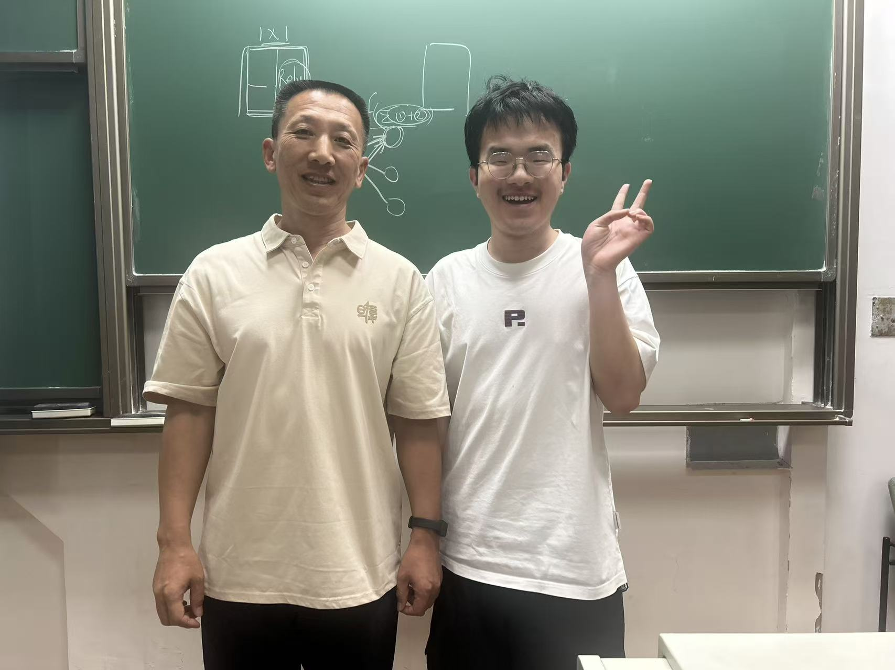

# -Foundations-of-Deep-Learning
This repository contains my personal lab implementations and projects for the course **"Foundations of Deep Learning"**, taught by the esteemed **Professor Sun Xiaoguang** at Fudan University during the Spring semester of 2025.

## 📚 Repository Overview

This repository serves as a comprehensive record of my learning journey into Deep Learning. It includes all the hands-on work that brought the theoretical concepts to life, from basic neural networks to advanced architectures like Transformers.

**To explore the homework assignments, including detailed lab reports and source code (in Jupyter Notebook or Python format), please switch to the respective branches.**

## 🧪 Coursework & Projects

The coursework covered a wide range of fundamental and cutting-edge topics, with practical implementations including but not limited to:
- **Convolutional Neural Networks (CNNs)** for image classification and style transfer.
- **Recurrent Neural Networks (RNNs) & LSTMs** for sequential data analysis.
- **Transformer Models** and their application in Natural Language Processing (NLP).
- **Diffusion Models** for image generation and reconstruction.
- **Large Multimodal Models** for analysis of multimodal data.
- **Local deployment and interaction with Large Language Models (LLMs)** using tools like Ollama.
- **Deep reinforcement learning** is used to design games according to huggingface

## 🎓 A Personal Note of Gratitude

**结课当日与孙老师的珍贵合影，摄于2025年6月**

This course was a pivotal point in my academic path. As a Pharmacy student with no prior computer science background, I was initially hesitant. However, Professor Sun's exceptional ability to demystify complex concepts and his focus on teaching us "*how to learn*" made all the difference.

The hands-on experience gained here—from building RNNs from scratch to deploying LLMs locally—not only unveiled the immense potential of AI but also gave me the confidence to fully transition into AI-driven research. I am profoundly grateful to Professor Sun for being the guide who opened this door to an interdisciplinary and exciting future.

> *"A teacher affects eternity; he can never tell where his influence stops."*  
> — This repository is a small testament to that influence.

## 📁 Additional Resources

I have also uploaded the course presentation slides (`PPTs/`) used by Professor Sun, which are models of clarity and succinctness and were instrumental in my understanding.

---

**Last updated: Novemeber 2025*** for structured data.
- Local deployment and interaction with Large Language Models (LLMs) using tools like Ollama.
